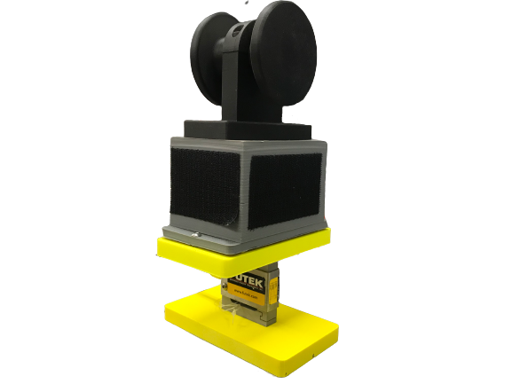
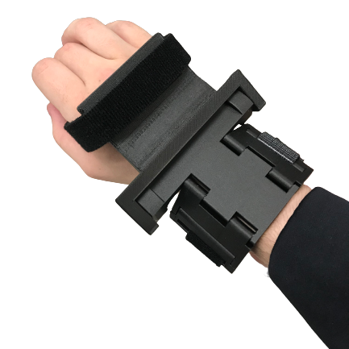
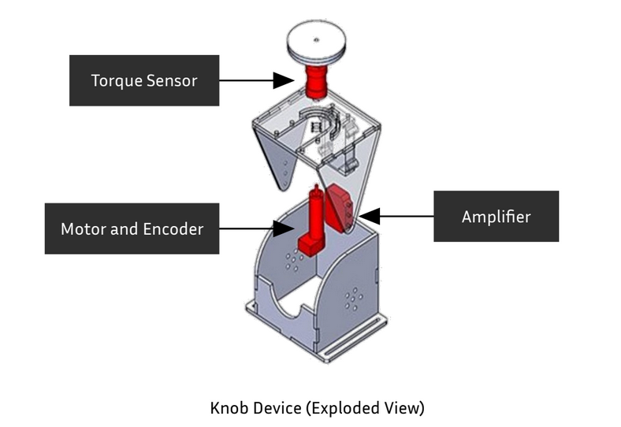

# CSULB BUILD Hand Project

As an CSULB NIH BUILD Scholar I worked in the Robotics and Interactive Systems Engineering laboratory on a hand rehabilitation project. This project was co-advised by Dr. Panadda Marayong and Dr. I-Hung Khoo (many thanks to them!). The goal of our project was to measure hand forces and torques for evaluation and rehabilitative training of individuals with hand impairment. Our project consists of a knob device and a grip-load device to simulate interactions that involve power and precision. Below you can find more details on each device and some other work I did.

> [!NOTE]
> This repo is primary for future csulb students that will build ontop of the work I and many previous students developed. However anyone can view/use the material. Feel free to contact me if you have any questions!

## Contents
- [Grip Load Device](#grip-load-device)
- [Brace](#bracee)
- [Knob Device](#knob-device)
- [Hapkit](#hapkit)

## GRIP LOAD DEVICE
The Grip-Load Device (GLD) runs on a Arduino Uno and incorporates data from three sensors:
- MPU6050 for acceleration to measure load force during dynamic tests. 
- LCFD-50 load cell to capture grip force 
- LSB302 Futek load cell to assess load force during static tests

The purpose of this device is to assess the differences in grip-load force coordination between healthy and hand impaired individuals. We also hope this device can provide rehabilitative training to individuals with hand impairment.

Dive deeper into the Grip Load Device:

# Brace
A 2 piece 3d printed adjustable brace to explore the effects of wrist position on grip-load force coordination. It can be set at -30, 0, and 30 degrees at the wrist.

Head to the Brace directory: 

# Knob Device
The knob device centers around an Arduino Uno, sending data to a  graphical user interface (GUI) and controlling a haptic interface. This device aims to assess the coordination between grasping force and  turning torque. LabVIEW  handles the GUI and data acquisition. The haptic interface comprises a HEDS encoder, a maxon A-max motor, force sensing resistors  (FSR), and a torque sensor.

Dive deeper into the Knob Device:

# Hapkit
Some design changes were made to the open-source Hapkit 10.01.14 from Stanford to fit with available hardware at the RISE Lab @CSULB. 

