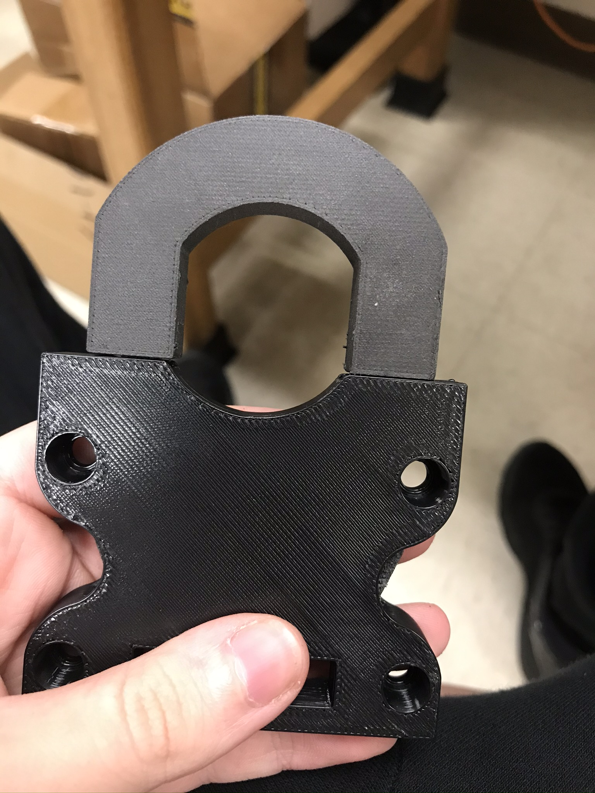
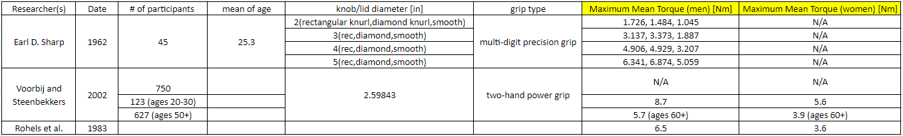

## Knob Device

Project Timeline: June 2020 - May 2021

[Watch a presentation I gave to learn more!](https://www.youtube.com/watch?v=llJ-72yHejI)

#### For future students:
The code from this device has not been updated since mid 2021 so it can use some improvements. See the [Grip Load Device LabVIEW code](../grip-load-device/LabVIEW/) for improving the LabVIEW code. Improvements can be made on the arduino code to add/change the haptic environment (ex: Spring and Damper). Hardware/Sensor improvements are also welcome, since FSR's are not reliable quantitatively. 

My final work on this device was this 3D-printed snap lock for the torque sensor. This piece was never fully tested to support the torque we expect users to apply. Here would be a good place to start!

Snap Lock:

Some notes on recorded max torque:

